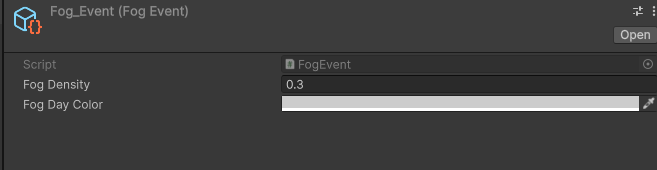
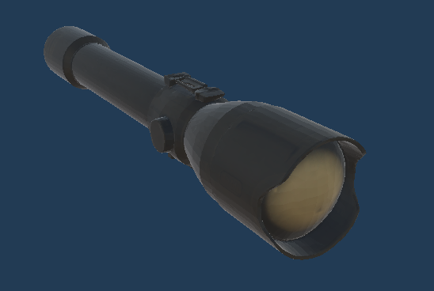
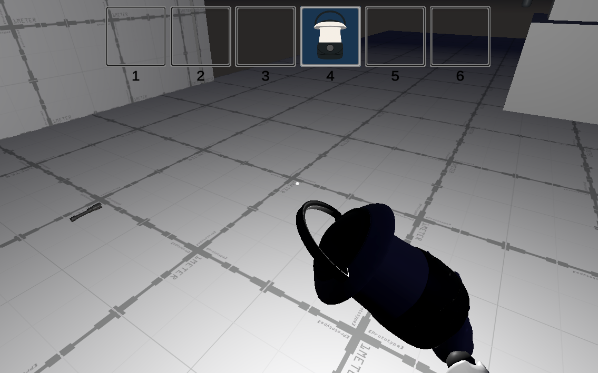

<h1 align="center"><strong>Rapport de TER (Travail d’Étude et de Recherche) – Master Informatique</strong></h1>

<h2 align="center">Prototypage d'un Jeu de Labyrinthe Urbain</h2>

<table width="100%">
  <tr>
    <td align="left" style="vertical-align: bottom;">
      <strong>Nom :</strong> 
       
      <strong>Formation :</strong> Master Informatique
       
      <strong>Université :</strong> Université d'Artois  
       
      <strong>Année universitaire :</strong> 2024 – 2025
    </td>
    <td align="right" style="vertical-align: bottom;">
      <strong>Date de rendu :</strong> Juin 2025 
      
    </td>
  </tr>
</table>

## Table des matières

- [Table des matières](#table-des-matières)
- [Contexte du jeu](#contexte-du-jeu)
- [Introduction](#introduction)
  - [État du projet à mon arrivée](#état-du-projet-à-mon-arrivée)
  - [Objectifs restants à implémenter](#objectifs-restants-à-implémenter)
  - [Fonctionnalités supplémentaires décidées en équipe](#fonctionnalités-supplémentaires-décidées-en-équipe)
- [Premiers pas avec Unity](#premiers-pas-avec-unity)
- [Animation et comportement du monstre Chaser](#animation-et-comportement-du-monstre-chaser)
- [Implémentation du système de reconfiguration des touches (rebind System)](#implémentation-du-système-de-reconfiguration-des-touches-rebind-system)
  - [Navigation clavier dans le menu](#navigation-clavier-dans-le-menu)
- [Problèmes rencontrés et résolutions](#problèmes-rencontrés-et-résolutions)
- [Utilisation des tooltips](#utilisation-des-tooltips)
- [Système d'apparition d’objets](#système-dapparition-dobjets)
- [Système de détection sonore et SoundData](#système-de-détection-sonore-et-sounddata)
- [Implémentation de la boussole](#implémentation-de-la-boussole)
- [Cycle jour/nuit et météo](#cycle-journuit-et-météo)
  - [Skybox procédurale](#skybox-procédurale)
  - [Simulation du soleil](#simulation-du-soleil)
  - [Lune et lumière nocturne](#lune-et-lumière-nocturne)
  - [Gestion de l’ambiance et de l’atmosphère](#gestion-de-lambiance-et-de-latmosphère)
  - [Intégration d'événements météo](#intégration-dévénements-météo)
- [Lampe torche](#lampe-torche)
- [Génération manuelle du niveau et optimisation](#génération-manuelle-du-niveau-et-optimisation)
  - [Générateur de meubles](#générateur-de-meubles)
  - [Zone d’arrivée du jeu](#zone-darrivée-du-jeu)
  - [Génération manuelle d’un niveau](#génération-manuelle-dun-niveau)
- [Travail réalisé pendant la dernière semaine](#travail-réalisé-pendant-la-dernière-semaine)
  - [Lanterne](#lanterne)
  - [Modèle de poubelle](#modèle-de-poubelle)
  - [Ajustements](#ajustements)
- [Bilan personnel et perspectives](#bilan-personnel-et-perspectives)
  - [Ce que j’ai appris](#ce-que-jai-appris)
  - [Ce que j’aurais aimé faire davantage](#ce-que-jaurais-aimé-faire-davantage)
- [Conclusion](#conclusion)
- [Glossaire](#glossaire)
- [Bibliographie](#bibliographie)

## Contexte du jeu

Inspiré de la nouvelle “C@ptch@” (du livre Aucun souvenir assez solide d’Alain Damasio), le jeu est un rogue-like dans un post-apo technologique où la récupération d’informations est devenue tellement avancée et automatisée que l’humanité a presque disparu. Les humains restants étant utilisés par ces automates en recherche constante de nouvelles informations, se caractérisant par la séparation des enfants de leurs parents à la naissance de ces derniers. Ainsi, ces enfants croient pouvoir retrouver leurs parents en traversant cette ville où vivent ces automates attendant avec impatience ces nouvelles informations à capturer.
Ainsi, le but du jeu est d’incarner un enfant qui doit traverser cette ville pour rejoindre ses parents se trouvant de l’autre côté. Cette dernière étant peuplée de pièges et de drônes, pouvant faire disparaître des membres à leur contact (appelé digitalisation). La digitalisation complète du joueur étant synonyme de mort, le joueur incarnera un nouvel enfant pour tenter d’aller plus loin et mieux comprendre les pièges que cette ville lui réserve. 

---

## Introduction

Ce rapport présente le travail que j’ai réalisé dans le cadre de mon TER (Travail d'Étude et de Recherche). Le projet consiste à concevoir et développer un jeu vidéo sous Unity, en collaboration avec un binôme. Le projet n’a pas été commencé de zéro : je suis arrivé **en cours de développement**, sur une base existante construite par mon binôme.

### État du projet à mon arrivée

Comme nous avons préféré ne pas reprendre le projet depuis zéro, nous sommes partis d’un socle fonctionnel déjà implémenté par mon binôme. Voici une liste des éléments déjà présents lorsque j’ai rejoint le projet :

**✅ Système de joueur:**
- Gestion des déplacements (marcher, courir, s'accroupir, sauter)
- Gestion de la caméra
- Contrôle des deux mains pour l'inventaire et les interactions
- Gestion de l'inventaire (ajout, sélection, lancer) avec interface utilisateur ([UI](#ui))
- Interaction avec les objets
- Gestion des membres du corps du joueur (et affichage [UI](#ui) associé)

**✅ Ennemi de base :**
- Machine à états fonctionnelle
- Comportements d’état de patrouille et d’état de traque

**✅ Objets interactifs :**
- Une porte avec double interaction (poignée ou panneau pour ouverture violente ou tranquille)
- Un caillou et une boîte de conserve pouvant être mis dans l’inventaire

**✅ Éléments de décor :**
- Lampadaire avec trois états (allumé, cassé, défectueux)

**✅ Pièges :**
- Poignée de porte piégée (supprime la main)
- Lampadaire piégé (tue le joueur ou détruit un objet passant sous la lumière)
- Plaque de pression (supprime les pieds ou jambes, ou détruit l’objet selon ce qui l’active)

**✅ Système de son :**
- Composant permettant à un émetteur (joueur ou objet) de diffuser un son dans une zone donnée, détectable par les ennemis

**✅ Menus et interfaces :**
- Menus de base :
  - Menu principal
  - Menu pause
  - Menu des options (réglage du volume des musiques et des effets)
  - Menu de fin de partie (victoire ou défaite)
  - Menu de lancement de partie
- Systèmes de navigation restreints à un axe (X ou Y)

**✅ Scènes déjà créées :**
- Menu principal
- Niveau pacifique (zone d’attente pour le joueur avec possibilité de se déplacer et tester les interactions)

### Objectifs restants à implémenter

Pour obtenir un **prototype jouable complet**, il restait à :
- Créer un niveau non-procédural représentant une ville avec bâtiments, routes, trottoirs, et décor
- Ajouter des pièges et ennemis dans ce niveau
- Ajouter des objets interactifs
- Ajouter des animations pour les actions du joueur, notamment la perte de membres (meilleure lisibilité du gameplay)

### Fonctionnalités supplémentaires décidées en équipe

Nous avons aussi fait le choix d’enrichir le projet avec des fonctionnalités supplémentaires :
- Implémentation d’un **nouvel ennemi chasseur**
- Amélioration des menus (navigation sur les deux axes, meilleure gestion des éléments sélectionnables)
- Ajout d’un **menu de reconfiguration des touches**
- Mise en place d’un **cycle jour/nuit** servant de limite de temps par partie
- Ajout de **nouveaux objets et pièges**

---

## Premiers pas avec Unity

Les deux premières semaines du TER ont été consacrées à la découverte du fonctionnement de Unity.  
Plus globalement, j’ai appris comment fonctionne un moteur de jeu dans son ensemble.

Unity s’est révélé être une excellente porte d’entrée dans ce domaine : contrairement à Unreal Engine, il propose une interface et un écosystème plus légers, avec moins de fonctionnalités complexes, ce qui le rend plus accessible pour débuter. Il permet également d'apprendre le langage C# qui est utile même en dehors de la création du jeu vidéo ce qui rend ainsi cet apprentissage encore plus utile.

Depuis sa dernière version majeure Unity 6, Unity propose directement des **projets tutoriels intégrés** dans l’éditeur. Cela m’a permis de me familiariser plus facilement avec les bases du moteur de jeu.

J’ai aussi suivi plusieurs **tutoriels sur YouTube**, notamment pour mieux comprendre comment réaliser certaines actions spécifiques dans Unity telles que les animations et les déplacements.

L’apprentissage des bases s’est fait sur un **projet séparé**, nécessaire pour pouvoir suivre et tester les tutoriels proposés par Unity.

  
> *Cette image montre la scène de test utilisée durant tout le projet. C’est ici que j’ai réalisé la majorité de mes expérimentations et appris à mettre en œuvre les premières fonctionnalités utiles pour le jeu.*

---

## Animation et comportement du monstre Chaser

Durant la troisième semaine, j’ai travaillé sur l’implémentation d’un type d’ennemi appelé **Chaser**. Il s’agit d’un loup mécanique capable de détecter le joueur lorsqu’il reste dans son champ de vision pendant un certain temps, puis de déclencher une alerte sonore et d’informer les autres ennemis dans un rayon défini.

Le système de détection fonctionne ainsi : lorsqu’un joueur entre dans une zone de détection sphérique autour du Chaser, ce dernier commence à surveiller sa position. Si le joueur reste visible pendant une certaine durée, l’ennemi entre en **mode alerte**, déclenche une **alarme sonore**, et commence à le **poursuivre activement**. Il peut également **avertir les autres ennemis** présents à proximité.

> *Figure 3 : La zone de vision de l’ennemi (En bleu clair)*

---

J’ai utilisé un [prefab](#prefab) conçu dans une scène de test. Son apparence a été générée via l’IA **Meshy**, et les animations proviennent de l'iA **Anything World**. J’ai choisi ces outils car je ne maîtrise pas la modélisation et l’animation 3D, et je n’avais pas trouvé de ressources visuelles correspondant à ce que je voulais.

> *Figure 1 : Apparence du [prefab](#prefab) du loup mécanique représentant un enemy de type Chaser dans Unity*

---

Lorsque le **Chaser** détecte le joueur pendant une durée prédéfinie, alors le **Chaser** émet un son d'alarme. Le son en question a été généré par l’IA Freepik car je n'avais pas réussi à trouver ce que je voulais.
Et aussi car le son généré me convenait.

L’intégration des animations s’est faite facilement grâce au système d'animation `Animator` dans Unity, que j’ai trouvé relativement intuitif. Pour le comportement général, j’ai utilisé une **machine à états** afin que le Chaser puisse basculer dynamiquement entre les états de patrouille, de poursuite ou d’inactivité, selon le contexte.

> *Figure 2 : Animation du Chaser en mode poursuite*

Cette image illustre une animation du Chaser lorsqu’il poursuit le joueur.

---

J'ai bien aimé travailler sur le fonctionnement du Chaser, bien que celui-ci m'ait fait rencontrer des difficultés lors de sa création.  
En effet, créer un comportement non unique et donc réutilisable s’est révélé être difficile à mettre en place.  
Cela m’a obligé à comprendre le fonctionnement d’une **machine à états**, ainsi que la façon de structurer proprement les transitions entre états comme la patrouille, la poursuite ou l’alerte.  
Cette partie a été bien plus difficile à mettre en place que la prise en main de l’Animator, qui lui est assez intuitif une fois compris.

---

## Implémentation du système de reconfiguration des touches ([rebind System](#rebind))

Après la mise en place du Chaser, j’ai travaillé sur un menu permettant au joueur de modifier les touches du jeu selon ses préférences, c'est ce que l'on appelle un système de [rebind](#rebind) (ou configuration de touche en français).

J’ai utilisé un sample fourni avec la ressource officiel de **[l'input system](#inputsystem)** de Unity, appelé **[rebind UI](#rebind)**. Ce sample est très complet : il permet de relier des actions à des touches via une interface, et gère la plupart des cas d’usage. Cependant, il n’inclut pas la détection de conflits (lorsqu’une touche est déjà assignée ailleurs). J’ai donc ajouté du code personnalisé pour empêcher un joueur d’attribuer plusieurs actions à une seule touche.

Un point fort de ce sample est qu’il fournit un **[prefab](#prefab) de bouton** déjà prêt à l'emploi, ce qui m’a permis de construire le menu rapidement. Chaque ligne du menu affiche une action, un bouton pour modifier la touche, et un bouton pour la réinitialiser individuellement. J'ai créé moi-même un bouton *Reset All* pour permettre également de tout réinitialiser en une seule fois.

> *Figure 1 : Menu principal de reconfiguration des touches avec bouton reset global*

---

Pour construire ce menu, j’ai placé tous les boutons dans un **[Canvas](#canvas)**, à l’intérieur d’un objet de type `Image`. J’y ai ajouté un script qui met à jour dynamiquement l’affichage des touches modifiées. À chaque reconfiguration, je vérifie les données du fichier JSON où sont stockées les préférences des touches pour ainsi permettre d'avoir le changement de touche directement et sans devoir redémarrer le jeu.

Certains contrôles, comme ceux permettant de quitter un menu, ne sont volontairement **pas modifiables**, afin de garantir une experience sans problème pour l’utilisateur.

Le menu a été conçu pour afficher chaque action de manière claire, avec une cohérence visuelle. Chaque ligne du menu dispose :
- d’un bouton de modification de touche
- d’un bouton de réinitialisation individuelle

> *Figure 2 : Le message affiché lorsqu'on souhaite réassigner une touche*

---

### Navigation clavier dans le menu

Il est également possible de **naviguer dans le menu avec les touches directionnelles** du clavier. Cela a été rendu possible grâce à une classe personnalisée appelée `MenuNavigable`, écrite par mon binôme. Cette classe est intégrée à l’objet parent du menu et permet d’indiquer, pour chaque bouton, où aller lorsque l'on appuie sur les touches pour se déplacer dans chaque direction.

Ce système m’a demandé du temps à configurer, car il fallait définir manuellement les liaisons entre les boutons, direction par direction.

---

## Problèmes rencontrés et résolutions

L’un des problèmes que j’ai rencontrés est que les modifications n’étaient **pas prises en compte pendant le jeu** : elles ne s’appliquaient que si on redémarrait la scène ou le jeu. Ce problème venait de l’utilisation de la **classe générée automatiquement** par l’[Input System](#inputsystem), lorsqu'on instanciait cette classe dans celle gérant les déplacements du joueur. 
Cette classe empêche de :
- modifier les [actionmap](#actionmap) dynamiquement
- désactiver une [actionmap](#actionmap) pendant l’exécution
- appliquer les modifications de touches pendant l’exécution du jeu

Pour corriger cela, j’ai donc remplacé l'appel à cette classe auto-générée par une approche utilisant directement les InputAction (un système sur Unity qui permet de gérer directement tout ce qui est lié au action des touches). Cela m’a permis :
- de modifier les touches pendant le jeu
- d'avoir les changements pris en compte dans toutes les scènes
- d’activer/désactiver dynamiquement les [actionmap](#actionmap) selon les besoins pour éviter un possible conflit de touches entre le menu et le jeu

Un autre bug est apparu dans la **scène de départ** : le joueur ne pouvait plus bouger. Après de nombreux tests, j’ai compris que l’[actionmap](#actionmap) n’était pas activée à l'apparition du joueur, car une option dans l’éditeur Unity n’était pas cochée. Ce problème m’a fait réaliser l’importance d’ajouter des **[tooltips](#tooltip)** aux variables visibles.

---

## Utilisation des [tooltips](#tooltip)

Suite à ce bug, j’ai ajouté des **[tooltips](#tooltip)** dans toutes les classes ayant des variables exposées dans l’[inspecteur](#inspecteur) Unity. Cela permet :
- d’expliquer clairement à quoi sert chaque champ
- d’éviter des erreurs de configuration
- d’améliorer la compréhension du code pour les autres développeurs

Cela m'a également permis de voir le code de tout ce que mon binôme avait déjà fait avant le début du projet.

---

## Système d'apparition d’objets

La semaine suivante, j’ai travaillé sur l’implémentation d’un système de **d'apparition aléatoire d’objets dans une salle**. L’objectif est de pouvoir générer dynamiquement certains objets dans des points d’apparition prédéfinis, transmis au script sous forme de listes.

Pour cela, j’ai créé une structure nommée `SpawnableProperties`, contenant :
- un [gameobject](#gameobject) à faire apparaître
- une **probabilité** d'apparition, exprimée sous forme de **poids** entre 1 et 99  
  (plus le poids est élevé, plus l’objet a de chances d’apparaître)

J’avais choisi cette méthode car le `struct` est **très clair visuellement dans [l’inspecteur](#inspecteur) de Unity**, ce qui permet une configuration rapide et propre. Cela m’a aussi évité d’avoir à créer un grand nombre de [scriptableobject](#scriptableobject) différents.

J’ai également développé une **classe de gestion des apparitions d'objet**, qui prend :
- une **liste de `SpawnableProperties`** pour les objets à faire apparaître
- une **liste de `Transform`** représentant les points d’apparition

Ce système fonctionne **non seulement dans une salle**, mais aussi dans **toute autre zone** du jeu. Il suffit de définir les points d'apparition dans la scène, et le système gère le reste en fonction des poids attribués.

Cette fonctionnalité a été assez rapide à développer, mais elle est très utile car elle est **réutilisable partout** dans le jeu.

> *Figure : Exemple d’étagère avec plusieurs objets générés aléatoirement sur ses étages grâce au système d'apparition*

Plus tard au cours du projet j'ai changé la structure en classe en gardant ce qu'il y avait déjà et en ajoutant une fonction de calcul dedans. Car cela m'a permis pour chaque objet de calculer la distance entre le centre et leur point le plus bas pour ainsi éviter au maximum d'avoir des objets qui apparaissent à moitié dans le sol (car cela pouvait arriver). Pour ainsi ajouter cette distance calculé a la position `y` de l'objet.

---

## Système de détection sonore et SoundData

Ensuite, dans le reste de la semaine, je me suis occupé d’un ticket demandant d’améliorer le système de sélection de l’ennemi en fonction du son. Le problème était que, s’il y avait plusieurs sons, il n’y avait rien pour lui indiquer lequel il devait suivre. Le système que j’ai mis en place repose sur le fait que l’ennemi doit poursuivre la source du **son avec le volume perçu le plus élevé**. Ce volume est recalculé régulièrement, car l’intensité d’un son diminue avec le temps.

Pour faire cela, j’ai créé deux [scriptableobject](#scriptableobject) :
- `SoundData` : celui utilisé actuellement
- `Player SoundData` : pas encore utilisé mais prévu pour la suite

J’ai utilisé `SoundData` pour remplacer les anciennes variables séparées (comme l’audio clip, l’intensité initiale, etc.) dans les objets. Cela rend le code **plus propre, mieux organisé et plus facile à maintenir**. Dans `SoundData`, j’ai ajouté une nouvelle variable appelée `volume pourcentage`, qui permet de régler dynamiquement la puissance du son.

J’ai ensuite modifié les classes `Enemy` et `SoundEmitter` pour intégrer ce nouveau système.

Dans `Enemy`, j’ai ajouté une méthode qui **met à jour la cible** si un son perçu a un volume supérieur à celui précédemment entendu.

Dans `SoundEmitter`, j’ai ajouté une nouvelle méthode statique `EmitSound` (il y a plusieurs surcharges de cette méthode). Cette version de `EmitSound` utilise les informations de `SoundData` pour :
- déterminer la puissance du son à propager
- prévenir les ennemis dans la zone d’émission
- permettre au bon ennemi de changer de cible selon l’intensité du son

  
> *Figure : Exemple d’un [scriptableobject](#scriptableobject) `SoundData` avec ses propriétés dans l’[inspecteur](#inspecteur) Unity*

---

## Implémentation de la boussole

À partir du mardi 5 mai, j’ai commencé à travailler sur **la boussole**, un nouvel objet de gameplay.

Sa particularité est qu’elle doit **pointer uniquement vers le nord**, c’est-à-dire vers un objectif défini dynamiquement à chaque partie. En effet, comme les niveaux seront générés de manière procédurale, l’objectif ne sera pas toujours au même endroit.

Pour rendre la boussole compatible avec cela :
- J’ai attribué un **tag spécifique** à l’objectif.
- Grâce à `FindWithTag`, je localise dynamiquement le [gameobject](#gameobject) de l’objectif.

> *Figure : Le [prefab](#prefab) de la boussole dans Unity*

Il existe **deux [prefabs](#prefab)** pour la boussole :
1. Celui posé au sol
2. Celui tenu en main par le joueur

Pourquoi deux ? Parce que c’est comme ça que les autres objets étaient faits. Cela évite des collisions ou des conflits sonores, et cela permet aussi d’avoir un objet non intéractible en main, alors que celui qui se trouve au sol est intéractible. 
Si un jour mon binôme souhaite mettre en place un système de multijoueur dans le jeu, il n'aura pas à refaire le système d'objet dans le jeu puisque ce dernier empêche déjà de récupérer un objet dans la main d'un joueur.

Quand le joueur ramasse une boussole :
- L’objet au sol est détruit
- Un nouveau [prefab](#prefab) est instancié dans la main

---

L’un des problèmes rencontrés a été que l’aiguille ne tournait pas correctement. Pour résoudre le problème j'ai dû:
- Bloquer la rotation sur l’axe Y
- Utiliser une **rotation locale** (c’est-à-dire une rotation appliquée uniquement à l’objet lui-même, sans affecter ses parents ou ses enfants dans la hiérarchie), sinon c’est toute la boussole qui tournait

> *Figure : La boussole orientée vers l’objectif du joueur*

Par la suite, il y a eu un autre bug dont j'ai eu du mal à en identifier la cause : en effet le comportement changeait selon que l'on utilisait une boussole placée dans la scène ou instanciée par un spawner (système d'apparition d'objet).

J'ai mis du temps à faire fonctionner correctement les deux types de boussoles : soit la boussole en main s'orientait correctement, soit c'était celle posée au sol.

J’ai donc séparé le comportement avec une variable permettant à la boussole **de s’orienter par rapport à la caméra** lorsqu'elle est dans la main du joueur.

---

## Cycle jour/nuit et météo

Le 9 mai, j’ai commencé à développer un **système de cycle jour/nuit** dans Unity, avec gestion de la lumière, de la couleur du ciel et de la météo.

---

### Skybox procédurale

J’ai d’abord configuré une **skybox procédurale** manuellement (cela permet de lié le soleil et le ciel). Ce [Material](#material) permet au ciel et soleil de changer automatiquement d’apparence en fonction de l’heure.  
Il a été intégré dans les paramètres de lumière globale de Unity (Lighting → Environment), ce qui affecte directement le rendu visuel du ciel.

---

### Simulation du soleil

Le **mouvement du soleil** suit plusieurs plages horaires prédéfinies :
- Lever du soleil
- Journée
- Coucher du soleil
- Nuit

Pour chaque plage horaire, la **rotation du soleil** est ajustée progressivement pour donner un effet réaliste de déplacement dans le ciel.
Les plages horaire étant personalisable directement dans l'éditeur grâce aux variables présentes dans le code.

  
> *Figure : Position du soleil au milieu de la journée*

L’orientation de la lumière influe aussi sur :
- la **luminosité ambiante**
- la **couleur de l’éclairage**
- l’ambiance générale du niveau

---

### Lune et lumière nocturne

Une **source lumineuse représentant la lune** a été ajoutée en complément du soleil.  
Contrairement au soleil, la lune reste **fixe dans le ciel** (ce choix a été fait pour simplifier le système et éviter les conflits dans les rotations).

Elle ne s’active **que pendant la nuit**, avec une intensité qui varie progressivement à l’entrée et à la sortie de cette phase.

  
> *Figure : Image de la lune dans le jeu en plaine nuit*

---

### Gestion de l’ambiance et de l’atmosphère

L’atmosphère visuelle évolue en continu grâce à plusieurs réglages dynamiques :
- **Épaisseur de l’atmosphère**
- **Lumière ambiante** et **réflexion globale**
- **Teinte du ciel** pour adapter les couleurs selon l’heure

> *Figure : Exemple visuel du ciel simulé au coucher du soleil*

---

Pour gérer tous ces paramètres, un script appelé `DayNightManager` permet de centraliser :
- la rotation du soleil
- la variation de luminosité
- l’activation de la lune
- les effets atmosphériques

  

> *Figure : Réglages du cycle jour/nuit dans l’inspecteur Unity*

---

Ce script est attaché à un objet unique dans la scène Unity. Ce dernier est stocké sous forme de [prefab](#prefab) pour une réutilisation simple.

  
> *Figure : Prefab du `DayNightManager` dans la hiérarchie de la scène Unity*

---

### Intégration d'événements météo

En complément du cycle lumineux, j’ai ajouté un **système météo**.
Il permet, par exemple, de faire apparaître du **brouillard** à certains moments, selon :
- une **fenêtre horaire définie**
- une **probabilité d’apparition**

  
> *Figure : Événement météo configuré dans un [scriptableobject](#scriptableobject) dans l’inspecteur*

Chaque événement météo est modulaire et peut être activé/désactivé individuellement dans Unity.  
Ils sont centralisés dans un objet nommé `SkyboxProperties`, qui indique pour chaque événement :
- l’heure de début et de fin
- la chance d’activation

  
> *Figure : Liste des propriétés météo, avec réglage horaire et intensité*

---

Lorsque le brouillard est actif, Unity ajuste automatiquement l’effet dans la scène via `RenderSettings.fog`. Permettant ainsi d'ajouter un effet de brouillard très simplement. 
C’est une fonctionnalité intégrée qui ne demande pas beaucoup de ressources, mais qui contribue à l’ambiance du jeu. 

  

> *Figure : Brouillard actif dans une scène du jeu, généré par le système météo*

---

## Lampe torche

J’ai ensuite travaillé, du vendredi 16 mai au mardi 20 mai, sur une **lampe torche**. J’y ai intégré un **son ON/OFF**, ce qui améliore l’immersion. La torche peut être activée ou désactivée à l’aide d’un bouton spécifique.

L’objet fonctionne comme les autres objets interactifs tenus en main. Lorsqu’elle est activée, elle projette une zone de lumière devant le joueur, utile surtout dans les zones sombres pendant la nuit.
La seule différence est que la lampe torche utilise la même touche que celle permettant de prendre un objet pour s'allumer ou s'éteindre. C’est la modification du code existant pour que ce système fonctionne qui a pris le plus de temps à réaliser. En effet, il a été nécessaire de modifier une fonction du code mon binôme pour que ce système d'activation/désactivation fonctionne.

 
> *Figure : [prefab](#prefab) de la lampe torche dans l’éditeur Unity*

 
> *Figure : Lampe torche allumée en jeu, projetant une lumière dans l’obscurité*

---

## Génération manuelle du niveau et optimisation

Durant le reste de la semaine du 19 mai, j’ai travaillé sur plusieurs éléments liés à la construction du niveau et à l’optimisation du jeu.

---

### Générateur de meubles

Premièrement, j’ai travaillé sur le **générateur de meubles**, en commençant par les **cabinets**, puis les **étagères**.

L’objectif était de :
- Placer des **points d'apparition** dans chaque meuble
- Les intégrer dans les [scriptableobject](#scriptableobject) utilisés par le **système d'apparition**

> *Figure : Exemple de configuration d'apparition d’objets différents dans un cabinet*

J'ai également dû modifier le script de génération aléatoire d'objet car mon binôme a ajouté une **classe parente** permettant d'avoir une génération aléatoire en début de partie. Autrement dit tous les objets qui possèdent un script qui hérite de la classe parente `IGenerator` aura la fonction `generate()` de déclencher permettant ainsi de génerer les objets. J'ai donc dû modifier le nom de ma fonction permettant la génération en `generate()`. 

J'ai également par la suite fait un système de variation de `Material` utilisé pour un cabinet.

> *Figure : Exemple de configuration matériaux différents pour un même cabinet*

Ce script sera également exécuté par la fonction `generate()`, permettant ainsi d'avoir des cabinets de couleur différentes lors du lancement du jeu.

---

### Zone d’arrivée du jeu

Durant une après-midi, j’ai mis en place **la zone d’arrivée du jeu**, c’est-à-dire la zone que le joueur doit atteindre pour terminer la partie.

Pour cela j'ai dû générer un objet représentant l'arrivée mais sans texte car les IA de modélisation 3D sont très mauvaise pour ça. Ensuite j'ai mis l'objet sur le logiciel blender pour y ajouter le texte que je voulais en 3D.

> *Figure : Zone d’arrivée à traverser pour déclencher la fin du jeu*

Ensuite, j'ai écrit le code qui s'exécute lorsque le joueur passe à travers la zone d'arrivée. Cela a été très rapide à coder car j'ai pu le faire en quelques lignes seulement.
Lorsque le joueur entre dans cette zone, **le menu de victoire apparaît**.

  
> *Figure : Menu de victoire affiché quand l’objectif est atteint*

Ce menu propose au joueur de :
- Revenir au menu principal
- Recommencer une nouvelle partie

---

### Génération manuelle d’un niveau

Comme la **génération procédurale** n’est pas encore totalement prête, j’ai commencé à créer **un niveau à la main**. Cela garantit que nous aurons une **démo jouable stable** pour la soutenance, peu importe l’état d’avancement de l’algorithme procédural.

Ce travail m’a permis d'apprendre à:
- Créer un niveau complet et cohérent
- Repérer les éléments manquant pour la réalisation du niveau ou de repérer les possibles bugs
- Trouver des éléments nécessitant de l'optimisation

Par exemple, lorsque j'ai lancé le jeu pour le tester, j'ai vu qu'au lancement du niveau **trop d’objets étaient instanciés d’un coup**. La plupart de ces objets ont un **son de spawn**, ce qui entraîne une **surcharge audio** et nuit aux performances. Ce problème a été ensuite rapidement corrigé par mon binôme.

  
> *Figure : Vue de haut du niveau créé à la main.*

> Le niveau a été légèrement modifié par la suite ce n'est donc pas sa version finale.

---

## Travail réalisé pendant la dernière semaine

Durant la dernière semaine de travail, j’ai ajouté plusieurs éléments au projet, en complément des systèmes déjà existants.

---

### Lanterne

J’ai commencé par développer une **lanterne**, un nouvel objet similaire à la lampe torche, mais dont la **lumière se diffuse dans toutes les directions** au lieu de n'être que dans une seule direction.

Cela permet une meilleure visibilité dans l’environnement et offre un **avantage** au joueur la nuit.

Le fonctionnement est proche de celui de la lampe torche :
- Elle peut être ramassée et tenue en main
- Elle s’active via une touche
- Elle utilise un composant `Light` de type **Point Light** (qui éclaire dans toutes les directions à partir d’un point), avec une portée réglée dans l’éditeur

L’**asset visuel de la lanterne** a été généré via **Robin AI**, une IA qui permet de créer un modèle 3D à partir d’une image, avec textures intégrées, un peu comme Meshy.

> *Figure : [prefab](#prefab) de la lanterne*
> 

> *Figure : Lumière de la lanterne diffusée en pleine nuit dans une scène du jeu*

### Modèle de poubelle

J’ai également ajouté une **poubelle** dans le décor du jeu. Cet élément n’a pas de script spécifique : c’est simplement un **objet décoratif**. Mais dans le futur, il deviendra peut-être possible de l'ouvrir.

L’asset a été généré avec **Robin AI** à partir d’une simple image.

> *Figure : Asset de poubelle intégré au projet*

---

### Ajustements

Pour finir, j’ai pris le temps de tester le jeu afin de modifier certains éléments nécessaires tels que la lumosité de la lune et ainsi obtenir quelque chose de meilleure qualité. J'ai aussi vérifié tous les bâtiments afin de voir s'ils étaient correctement placés car parfois lorsque certain bâtiments ont une partie de leur mur au même endroit que celui d'autres bâtiment il peut y avoir des bug visuels. 

---

## Bilan personnel et perspectives

Ce TER (Travail d’Étude et de Recherche) m’a permis d’apprendre énormément, en particulier parce qu’il s’agissait d’un **projet déjà commencé**, que je devais rejoindre en cours de route. Il m’a fallu m’adapter au code existant, comprendre les choix qui avaient été faits, et développer des fonctionnalités qui s’intègrent proprement dans une base déjà en place.
J'ai également eu la possibilité de donner des idées sur certaines fonctionnalités existantes ou qui pouvaient être ajoutées.

Cela m’a également donné l’occasion de découvrir un moteur de jeu tel que Unity, que je n'avais jamais utilisé, ainsi que le langage C# et d’apprendre à les utiliser de manière concrète à travers un projet.

---

### Ce que j’ai appris

- Utiliser Unity pour créer un prototype de jeu
- Concevoir des systèmes **modulaires et réutilisables** (IA, météo, système d'apparition, interface, ...)
- Déboguer des comportements complexes ([colliders](#collider), Action Maps, [rebind](#rebind) system, ...)
- Réaliser des systèmes visuels dans un jeu (menu de configuration de touche, création d'un niveau, ...)
- Mieux commenter mon code (avec des [tooltips](#tooltip) ou des commentaires C# pour les fonctions)
- Travailler en équipe dans le cadre de la création d'un jeu vidéo

---

### Ce que j’aurais aimé faire davantage

- Ajouter **plus d’ennemis** avec des comportements différents pour enrichir le gameplay
- Améliorer davantage le menu de configuration des touches

---

## Conclusion

Ce TER m’a permis de m’immerger dans un projet de jeu vidéo concret. 
J’ai pu découvrir et comprendre **le fonctionnement d’un moteur de jeu comme Unity**, tout en réalisant des fonctionnalités variées : gameplay, interface, logique système, son, météo, et plus encore.

J’ai aussi appris à m’adapter à un code existant : lire, corriger et refactorer du code. 
Ce genre de situation est proche de ce que l'on peut vivre en entreprise, mais que je n'ai encore eu l’occasion d'expérimenter.
Cela m’a donc permis, grâce à cet aperçu de ce que pourrait être le travail en entreprise, d’être mieux préparé pour le monde professionnel.

---

## Glossaire

> Ce glossaire explique les termes techniques utilisés dans le rapport, pour garantir la clarté à toute personne lisant ce document sans expertise préalable en développement de jeux vidéo ou en Unity.

---

  
**Prefab** :  
Un "prefab" (ou "préfabriqué") est un modèle réutilisable d’objet dans Unity. Il permet de créer plusieurs instances d’un même objet avec les mêmes composants, comportements et apparence.

  
**GameObject** :  
C’est l’unité de base dans Unity. Un GameObject peut être un personnage, un objet, un son, une lumière, etc. C’est un conteneur qui regroupe des composants.

  
**ScriptableObject** :  
Type spécial d’objet dans Unity qui permet de stocker des données de manière indépendante. Très utile pour organiser des paramètres ou configurer des comportements réutilisables.

  
**Collider** :  
Composant permettant de détecter les collisions ou les contacts physiques entre objets.

  
**Action Map** :  
Dans le système de gestion d’input de Unity, une Action Map est un groupe de commandes (par exemple "Gameplay", "UI") qui peut être activé ou désactivé selon le contexte.

  
**Input System** :  
Système moderne de gestion des entrées (clavier, souris, manette...) dans Unity. Permet de créer des actions indépendamment des touches physiques.

  
**Rebind** (ou Rebind System) :  
Fonctionnalité permettant au joueur de reconfigurer les touches de contrôle selon ses préférences.

  
**ToolTip** :  
Texte d’aide affiché dans l’inspecteur Unity lorsqu’on survole une variable exposée. Sert à documenter le rôle de chaque paramètre.

  
**Skybox** :  
Image ou shader utilisé comme fond visuel dans une scène 3D, pour représenter le ciel, l’espace ou d’autres environnements.

  
**Material** :  
Dans Unity, un Material définit l'apparence visuelle d’un objet 3D. Il permet de contrôler sa couleur, sa texture, sa transparence, sa réflexion ou encore son rendu dans la lumière. Un Material utilise un Shader (programme graphique) pour déterminer comment la lumière interagit avec la surface de l’objet.

  
**UI (User Interface)** :  
L’ensemble des éléments visuels permettant l’interaction entre le joueur et le jeu (menus, inventaire, indicateurs…).

  
**Canvas** :  
Composant Unity utilisé pour dessiner l’interface utilisateur (UI) à l’écran.

  
**Inspecteur** :  
Fenêtre dans Unity qui permet de visualiser et modifier les propriétés d’un GameObject ou composant sélectionné dans la scène.

---

## Bibliographie

- [Unity Documentation](https://docs.unity3d.com/)
- [Unity Input System](https://docs.unity3d.com/Packages/com.unity.inputsystem/)
- Alain Damasio – *Aucun souvenir assez solide*, 2012
- [Meshy AI](https://www.meshy.ai/)
- [Anything World](https://anything.world/)
- [Freepik AI Sound Generator](https://www.freepik.com/)
- Tutoriels consultés : YouTube, forums Unity, Unity Learn

---

